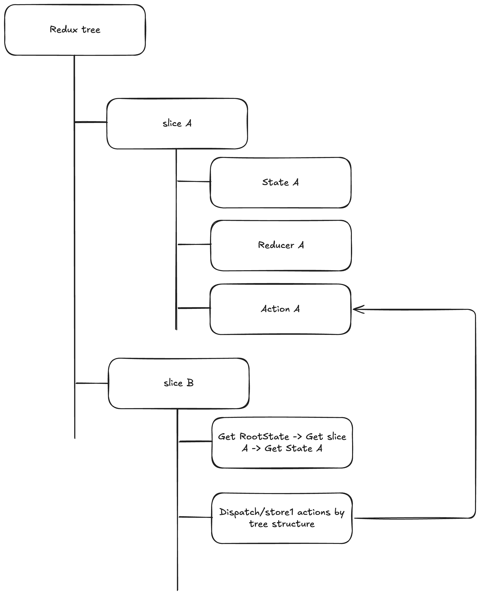

[简体中文版本](./README-zh.md)

# Comparison of Different TODOList Store Solutions

## Project Plan
1. Use two stores—`todolist` store and `users` store—to implement a full-featured TODO list, including create, read, update, and delete (CRUD) functionality.
2. The `todolist` store should be able to modify its state based on the data from the `users` store, such as filtering todos by the current user.
3. Both the `todolist` and `users` stores should support asynchronous data fetching via API calls.

| Comparison Aspect | [Redux](https://github.com/reduxjs/redux)                                   | [Reduck](https://github.com/web-infra-dev/reduck)                                        | [Zustand](https://github.com/pmndrs/zustand)                                    | [Jotai](https://github.com/pmndrs/)                                     |
| ----------------- | ------------------------------------- | --------------------------------------------- | ----------------------------------------- | ----------------------------------------- |
| Learning Curve    | High — Requires understanding actions, reducers, middleware, many concepts | Medium — Simplifies Redux concepts, supports cross-store access, has some custom APIs | Low — Only need to understand store and functional style, no extra complex concepts | Medium — Need to understand atom concept, distinguish read/write, async usage is relatively complex |
| Ease of Use       | Medium — Clear structure but verbose syntax | Medium — Simple API, easy cross-store use, but project is inactive | High — Lightweight, functional, no boilerplate | High — Atomic state management, fine-grained and flexible, but syntax a bit complex |
| Stars (2025)      | ⭐ 61.3k+                             | ⭐ 81 (inactive project)                       | ⭐ 53.9k+                                 | ⭐ 20.3k+                                 |
| Ecosystem Stability | High — Industry standard, widely adopted, active community | Low — Maintenance stalled, limited usage scenarios | Medium — Rapidly growing ecosystem, widely used in small projects | Medium — Emerging ecosystem, atomic state management gaining traction |
| Extensibility     | High — Supports middleware like redux-saga, redux-thunk, etc. | Medium — Supports effects but limited ecosystem | High — Supports middleware and layers, flexible and non-intrusive | High — Composable atoms, supports async and complex state derivations |
| Performance      | Medium — Based on Redux, batch updates and optimizations need manual handling | Medium — Redux-like, similar performance | High — Lightweight, localized updates, minimal and excellent performance | High — Atomic read/write, minimal update scope, excellent performance |

---

## Redux

A traditional and widely adopted open-source solution, developed alongside the evolution of React.



- store1
  - state
  - actions
  - reducer
- store2
  - How to access data from another store: Import `RootState` → access `store1` → get state from `store1` → access specific attributes
  - How to change data in another store: Import root `dispatch` / `store1` action → trigger reducer in `store1` → update its state

### Disadvantages of Redux

1. You must always decide whether a piece of data is synchronous or asynchronous (e.g., local component state vs. API data).
2. Accessing data from other stores involves understanding the global state tree and drilling into it step by step.
3. Each app has one large root store—how do you generalize this? By registering each sub-store into a root store.

---

## Reduck

A solution developed by ByteDance's web-infra team: [https://github.com/web-infra-dev/reduck](https://github.com/web-infra-dev/reduck), which appears to be unmaintained. 😑

The syntax is very simple, and you can see that cross-store access is straightforward via `use(usersModel)`.

```ts
export const todosModel = model<TodoState>("todos").define(
  (_context, { use }) => {
    return {
      state: initialState,
      actions: {
        addTodo: (state, { text, owner }: { text: string; owner: string }) => {
          // ...
        },
      },
      computed: {
        selectCurrentUserTodos(state) {
          const [{ name }] = use(usersModel);
          return state.list.filter((todo) => todo.owner === name);
        },
      },
      effects: {
        addTodoWithUser(text: string) {
          const [{ loggedIn, name }] = use(usersModel);
          const [{}, { addTodo }] = use(todosModel);
          if (loggedIn) {
            addTodo({ text, owner: name });
          }
        },
      },
    };
  }
);
```

Usage is also simple. After importing with useModel, you can access both state and actions/effects:

```TS
const [
    { selectCurrentUserTodos: todos },
    { addTodoWithUser, toggleTodo, deleteTodo },
  ] = useModel(todosModel);
```

## Zustand


A very practical and clean store solution. The core concept is just the store itself—no unnecessary complexity. Its functional approach is elegant. Unlike Reduck, you don't need to distinguish between props and methods; unlike Redux, there's no concept of reducers or actions.

```TS
import { create } from "zustand";
import { useUserStore } from "./userStore";

interface Todo {
  id: number;
  text: string;
  completed: boolean;
  owner: string;
}

interface TodoStore {
  list: Todo[];
  nextId: number;
  addTodo: (text: string, owner: string) => void;
  toggleTodo: (id: number) => void;
  deleteTodo: (id: number) => void;
  selectCurrentUserTodos: () => Todo[];
  addTodoWithUser: (text: string) => void;
}

export const useTodoStore = create<TodoStore>((set, get) => ({
  list: [],
  nextId: 1,

  addTodo: (text, owner) => {
    const { list, nextId } = get();
    const newTodo: Todo = {
      id: nextId,
      text,
      completed: false,
      owner,
    };
    set({
      list: [...list, newTodo],
      nextId: nextId + 1,
    });
  },

  toggleTodo: (id) => set((state) => ({
    list: state.list.map((todo) =>
      todo.id === id ? { ...todo, completed: !todo.completed } : todo
    ),
  })),

  deleteTodo: (id) => set((state) => ({
    list: state.list.filter((todo) => todo.id !== id),
  })),

  selectCurrentUserTodos: () => {
    const { list } = get();
    const { name } = useUserStore.getState(); // 获取当前登录用户名
    return list.filter((todo) => todo.owner === name);
  },

  addTodoWithUser: (text) => {
    const { name } = useUserStore.getState();
    if (!name) return;
    get().addTodo(text, name);
  },
}));
```

1. Declare the entire store type using `create<T>`.
2. States and actions are mixed together without distinction; if the property is very simple, it can be done in one line. Various middlewares can even simplify the get/set syntax.
3. Using `set` and `get`, you can access the store's own setter/getter methods, and also reference other stores—like `const { name } = useUserStore.getState();` to get properties from another store.


## Jotai

```TS
import { atom } from 'jotai'
import { userNameAtom } from './users';

export interface Todo {
  id: number;
  text: string;
  completed: boolean;
  owner: string;
}

const todoListAtom = atom<Todo[]>([])
const nextIdAtom = atom(1)

// CRUD methods
export const addTodoAtom = atom(null, (get, set, { text, owner }: { text: string; owner: string }) => {
  const id = get(nextIdAtom)
  const newTodo: Todo = { id, text, completed: false, owner }
  set(todoListAtom, [...get(todoListAtom), newTodo])
  set(nextIdAtom, id + 1)
})

export const toggleTodoAtom = atom(null, (get, set, id: number) => {
  const list = get(todoListAtom)
  set(
    todoListAtom,
    list.map((todo) =>
      todo.id === id ? { ...todo, completed: !todo.completed } : todo
    )
  )
})

export const deleteTodoAtom = atom(null, (get, set, id: number) => {
  const list = get(todoListAtom)
  set(todoListAtom, list.filter((todo) => todo.id !== id))
})

export const currentUserTodosAtom = atom((get) => {
  const todos = get(todoListAtom);
  const currentUser = get(userNameAtom);
  return todos.filter((todo) => todo.owner === currentUser);
});

// Add todo with current user
export const addTodoWithUserAtom = atom(null, (get, set, text: string) => {
  const user = get(userNameAtom)
  set(addTodoAtom, { text, owner: user })
})

// Export base state and methods
export {
  todoListAtom,
  nextIdAtom
}
```

The key point is the usage of `const currentUser = get(userNameAtom);` to access data from an external store. This shows that the code must explicitly read or write each atomic property.

In `App.tsx`, this usage implies a significant cognitive load because you need to understand whether each property is for reading or writing:

```ts
const [todos] = useAtom(currentUserTodosAtom);         // Derived atom, read-only. Returns todos for the current user.
const [, deleteTodo] = useAtom(deleteTodoAtom);        // Write-only atom, provides a function to delete a todo.
const [, logout] = useAtom(logoutAtom);                // Write-only atom, provides a logout function.
const [loggedIn] = useAtom(loggedInAtom);              // Primitive atom, holds login status.
const [name] = useAtom(userNameAtom);                  // Primitive atom, holds user name.
const [, login] = useAtom(loginAtom);                  // Write-only atom, executes login operation.
const [, addTodoWithUser] = useAtom(addTodoWithUserAtom); // Write-only atom, adds a todo for the current user.
const [, toggleTodo] = useAtom(toggleTodoAtom);        // Write-only atom, toggles todo completion status.
